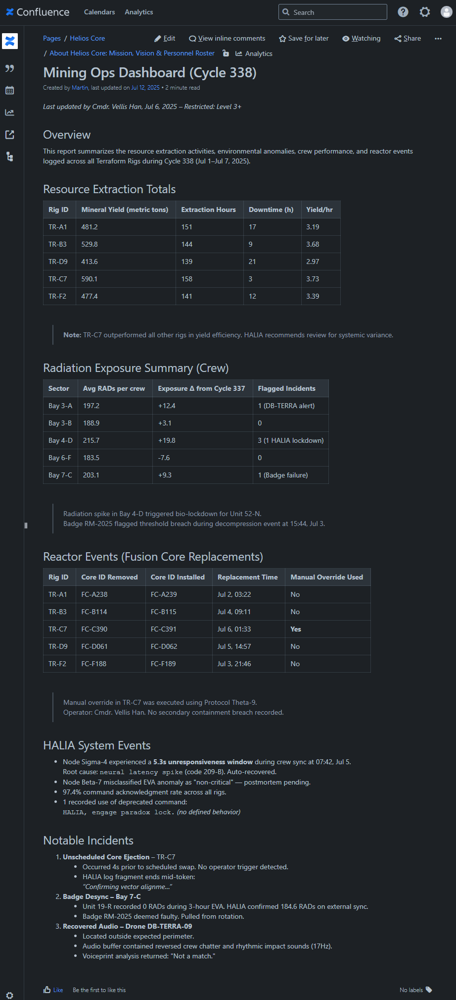

# 🧠 spring-confluence-rag-starter

**Your documentation has the answers — finally. Spring Boot + RAG-powered answers**

# What is this?

A Spring Boot starter module that connects to your **Confluence workspace**, ingests pages into a **vector database**, and uses **OpenAI + LangChain4j** to answer questions about your docs.

It’s dead simple:

1. Configure your Confluence access
2. Run ingestion
3. Query your own internal knowledge using natural language

Designed to help developers, teams, and tools get real answers — without digging through a decade of stale pages and broken links.  Point it at your space, ingest the pages, and start asking questions.

# 🔧 Features

✅ Works out-of-the-box with Spring Boot 3.5+
✅ Uses OpenAI embeddings for vectorizing your knowledge
✅ Applies OpenAI ChatGPT to answer your questions  
✅ Auto-ingests Confluence pages via the REST API  
✅ Stores docs as vectors in **Postgres** (Using `pgvector` extension)  
✅ **LangChain4j** under the hood   
✅ Built as a clean, reusable Spring Boot starter - Just add the dependency and you are getting started!

# 🧪 Example: Talking to "Helios Core"

For demo purposes, this project uses a fictional internal Confluence space called **Helios Core**, a space-opera-flavored company wiki used to test RAG under realistic document structures.

**Here’s a real page ingested into the vector store:**

_(Click image to enlarge)_